# 경로별 지도와 성공률

이 문서는 고정 경로 실험에서 쓴 24개 경로를 하나씩 그림으로 보여 주고, 각 경로에서 무슨
일이 일어났는지를 숫자와 함께 정리한다. 실험 전체의 결과와 해석은
[experiment_results_fixed_route.md](experiment_results_fixed_route.md)에 있으며, 이 문서는
그 결과를 경로 단위로 펼쳐 놓은 부록이다.

## 그림을 읽는 법

각 그림은 건물 한 채의 평면도이며 에이전트가 서 있을 수 있는 바닥면을 위에서 내려다본
것이다.

| 표시 | 뜻 |
|---|---|
| **회색 면** | 통행 가능한 바닥. 에이전트가 실제로 설 수 있는 곳이다 |
| **흰 면** | 벽, 가구, 건물 바깥 등 갈 수 없는 곳 |
| **청록색 원** | 출발 지점. 시연 20회마다 0.3 m·15° 범위에서 흔들어 여러 점으로 흩어져 있다 |
| **파란 선** | 시연된 경로. 최단 경로 전문가가 실제로 걸어간 자취이며, 정책이 학습한 정답이다 |
| **빨간 사각형** | 전문가가 멈춘 지점 |
| **주황 점** | 목표 관찰 지점. 목표 물체가 보이면서 설 수 있는 자리들이며, 성공 판정의 기준이다 |

**목표는 물체의 좌표가 아니라 주황 점의 집합이다.** 성공은 빨간 사각형이 주황 점 중 하나로부터
측지 거리 0.1 m 안에 들어왔을 때로 정의된다. 측지 거리란 벽을 돌아 실제로 걸어야 하는
거리를 말한다.

## 표를 읽는 법

| 열 | 뜻 |
|---|---|
| 관찰 지점 | 목표 집합의 크기 (주황 점의 개수) |
| 출발 거리 | 출발점에서 가장 가까운 관찰 지점까지의 측지 거리 중앙값 |
| 걸은 거리 / 스텝 | 전문가가 실제로 이동한 거리와 걸린 스텝 수의 중앙값 |
| **전문가 정지 거리** | 전문가가 멈춘 자리에서 가장 가까운 관찰 지점까지의 거리 중앙값 |
| 전문가 도달 | 시연 20회 중 0.1 m 안에 든 횟수 |
| oracle / VLM | 각 표현으로 학습한 정책의 주행 5회 중 성공 횟수. 0.1 m와 0.25 m 기준을 함께 적었다 |

**전문가 정지 거리가 이 문서에서 가장 중요한 숫자다.** 에이전트는 0.25 m 전진과 30° 회전만
할 수 있어 설 수 있는 자리가 격자를 이루는 반면, 관찰 지점은 그 격자와 무관하게 놓여 있다.
그래서 전문가가 아무리 정확히 걸어도 마지막에 서는 자리가 관찰 지점에서 몇 센티미터 떨어질
수 있고, 그 값이 0.1 m 아래면 그 경로는 항상 성공하며 위면 항상 실패한다. 아래 표에서
전문가 도달이 20/20인 경로와 0/20인 경로를 가르는 것은 경로의 길이도, 관찰 지점의 개수도
아니라 이 한 숫자다.


---

## 전체 요약

| 규칙 | 경로 | 목표 | 관찰지점 | 출발거리 | 걸은거리 | 전문가 정지거리 | 전문가 도달 | oracle @0.1 / @0.25 | VLM @0.1 / @0.25 |
|---|---|---|---|---|---|---|---|---|---|
| random | 00006 | 텔레비전 | 201 | 2.11 m | 2.41 m | **0.042 m** | 20/20 | 4/5 / 4/5 | 4/5 / 5/5 |
| random | 00009 | 텔레비전 | 409 | 12.1 m | 12.57 m | **0.126 m** ⚠ | 0/20 | 0/5 / 1/5 | 0/5 / 3/5 |
| random | 00016 | 소파 | 1022 | 4.57 m | 4.8 m | **0.06 m** | 20/20 | 4/5 / 4/5 | 4/5 / 4/5 |
| random | 00017 | 변기 | 25 | 4.73 m | 4.77 m | **0.047 m** | 20/20 | 4/5 / 5/5 | 2/5 / 4/5 |
| random | 00020 | 변기 | 124 | 5.17 m | 5.37 m | **0.11 m** ⚠ | 0/20 | 0/5 / 4/5 | 0/5 / 5/5 |
| random | 00022 | 의자 | 6414 | 4.94 m | 5.08 m | **0.071 m** | 17/20 | 4/5 / 5/5 | 4/5 / 5/5 |
| random | 00023 | 화분 | 975 | 11.99 m | 12.34 m | **0.107 m** ⚠ | 0/20 | 0/5 / 4/5 | 0/5 / 2/5 |
| random | 00025 | 텔레비전 | 115 | 8.14 m | 8.25 m | **0.051 m** | 20/20 | 1/5 / 2/5 | 1/5 / 4/5 |
| matched | 00006 | 변기 | 4 | 5.39 m | 5.6 m | **0.163 m** ⚠ | 0/20 | 0/5 / 3/5 | 0/5 / 4/5 |
| matched | 00009 | 소파 | 1267 | 5.29 m | 5.6 m | **0.104 m** ⚠ | 0/20 | 0/5 / 1/5 | 0/5 / 3/5 |
| matched | 00016 | 변기 | 199 | 5.52 m | 5.81 m | **0.059 m** | 20/20 | 4/5 / 4/5 | 3/5 / 4/5 |
| matched | 00017 | 변기 | 25 | 5.46 m | 5.51 m | **0.051 m** | 20/20 | 2/5 / 2/5 | 3/5 / 5/5 |
| matched | 00020 | 텔레비전 | 242 | 5.25 m | 5.61 m | **0.105 m** ⚠ | 0/20 | 0/5 / 5/5 | 0/5 / 4/5 |
| matched | 00022 | 의자 | 6414 | 5.19 m | 5.33 m | **0.063 m** | 19/20 | 3/5 / 4/5 | 3/5 / 5/5 |
| matched | 00023 | 소파 | 1151 | 6.11 m | 6.36 m | **0.106 m** ⚠ | 0/20 | 0/5 / 3/5 | 0/5 / 2/5 |
| matched | 00025 | 화분 | 1412 | 5.17 m | 5.31 m | **0.041 m** | 20/20 | 4/5 / 4/5 | 5/5 / 5/5 |
| junction | 00006 | 의자 | 1924 | 4.64 m | 5.0 m | **0.069 m** | 19/20 | 2/5 / 4/5 | 3/5 / 5/5 |
| junction | 00009 | 텔레비전 | 409 | 13.78 m | 14.32 m | **0.133 m** ⚠ | 0/20 | 0/5 / 2/5 | 0/5 / 2/5 |
| junction | 00016 | 텔레비전 | 15 | 7.24 m | 7.55 m | **0.066 m** | 20/20 | 1/5 / 1/5 | 1/5 / 1/5 |
| junction | 00017 | 텔레비전 | 332 | 14.69 m | 15.19 m | **0.034 m** | 20/20 | 4/5 / 4/5 | 1/5 / 3/5 |
| junction | 00020 | 화분 | 129 | 7.49 m | 7.88 m | **0.068 m** | 18/20 | 0/5 / 0/5 | 4/5 / 5/5 |
| junction | 00022 | 침대 | 3437 | 26.79 m | 27.57 m | **0.061 m** | 20/20 | 0/5 / 0/5 | 1/5 / 2/5 |
| junction | 00023 | 텔레비전 | 127 | 14.39 m | 14.88 m | **0.108 m** ⚠ | 0/20 | 0/5 / 5/5 | 0/5 / 5/5 |
| junction | 00025 | 침대 | 2346 | 5.15 m | 5.26 m | **0.033 m** | 20/20 | 2/5 / 3/5 | 3/5 / 4/5 |

⚠ 표시는 전문가가 20회 모두 0.1 m 안에 들지 못한 경로다. 이 경로들에서는 어떤 정책도 0.1 m 기준으로 성공할 수 없다.


---

## random — 무작위 선정

경로 8개, 전문가 도달률 97/160 = 0.606. 전문가가 한 번도 도달하지 못한 경로는 3개다.

### random · 00006-HkseAnWCgqk · 목표 = 텔레비전

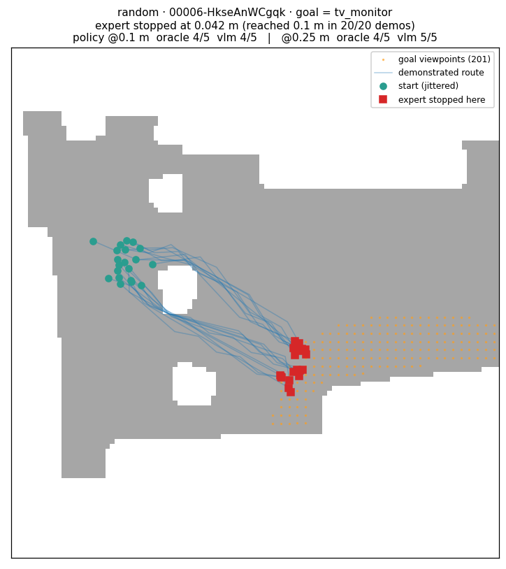

관찰 지점 201개 · 출발 거리 2.11 m · 걸은 거리 2.41 m (16 스텝) · **전문가 정지 거리 0.042 m** (범위 0.002~0.097) · 전문가 도달 20/20

정책 성공 — oracle 4/5 @0.1 m / 4/5 @0.25 m, VLM 4/5 @0.1 m / 5/5 @0.25 m

### random · 00009-vLpv2VX547B · 목표 = 텔레비전  ⚠ 전문가 도달 불가

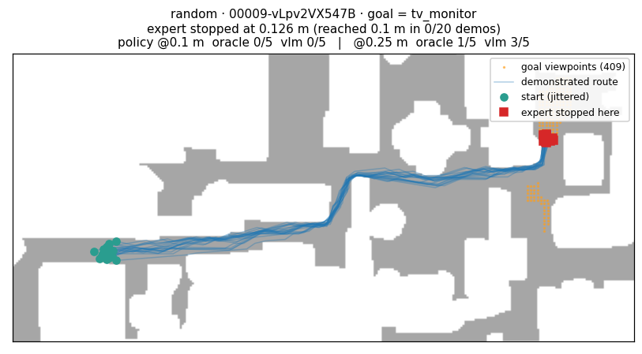

관찰 지점 409개 · 출발 거리 12.1 m · 걸은 거리 12.57 m (79 스텝) · **전문가 정지 거리 0.126 m** (범위 0.1~0.171) · 전문가 도달 0/20

정책 성공 — oracle 0/5 @0.1 m / 1/5 @0.25 m, VLM 0/5 @0.1 m / 3/5 @0.25 m

### random · 00016-qk9eeNeR4vw · 목표 = 소파

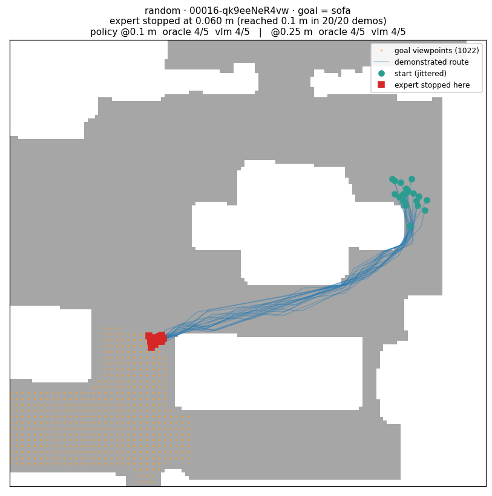

관찰 지점 1022개 · 출발 거리 4.57 m · 걸은 거리 4.8 m (28 스텝) · **전문가 정지 거리 0.06 m** (범위 0.05~0.094) · 전문가 도달 20/20

정책 성공 — oracle 4/5 @0.1 m / 4/5 @0.25 m, VLM 4/5 @0.1 m / 4/5 @0.25 m

### random · 00017-oEPjPNSPmzL · 목표 = 변기

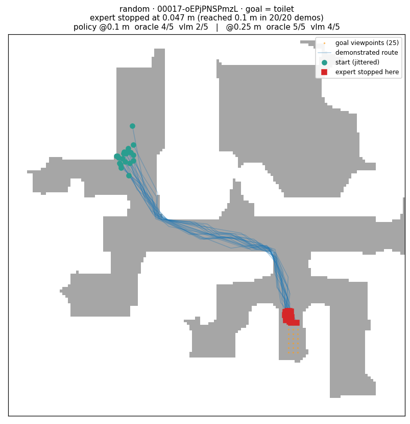

관찰 지점 25개 · 출발 거리 4.73 m · 걸은 거리 4.77 m (34 스텝) · **전문가 정지 거리 0.047 m** (범위 0.005~0.089) · 전문가 도달 20/20

정책 성공 — oracle 4/5 @0.1 m / 5/5 @0.25 m, VLM 2/5 @0.1 m / 4/5 @0.25 m

### random · 00020-XYyR54sxe6b · 목표 = 변기  ⚠ 전문가 도달 불가

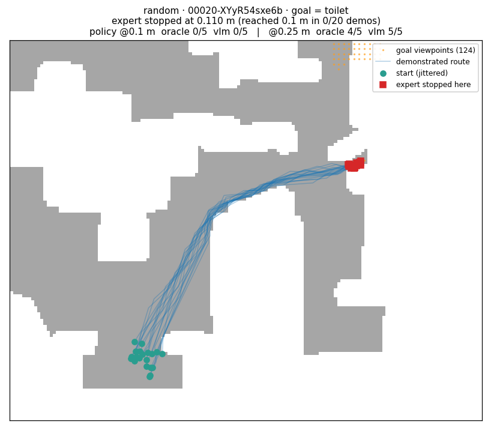

관찰 지점 124개 · 출발 거리 5.17 m · 걸은 거리 5.37 m (34 스텝) · **전문가 정지 거리 0.11 m** (범위 0.101~0.136) · 전문가 도달 0/20

정책 성공 — oracle 0/5 @0.1 m / 4/5 @0.25 m, VLM 0/5 @0.1 m / 5/5 @0.25 m

### random · 00022-gmuS7Wgsbrx · 목표 = 의자

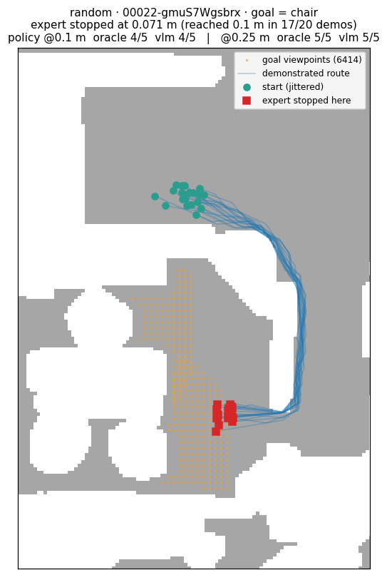

관찰 지점 6414개 · 출발 거리 4.94 m · 걸은 거리 5.08 m (33 스텝) · **전문가 정지 거리 0.071 m** (범위 0.054~0.105) · 전문가 도달 17/20

정책 성공 — oracle 4/5 @0.1 m / 5/5 @0.25 m, VLM 4/5 @0.1 m / 5/5 @0.25 m

### random · 00023-zepmXAdrpjR · 목표 = 화분  ⚠ 전문가 도달 불가

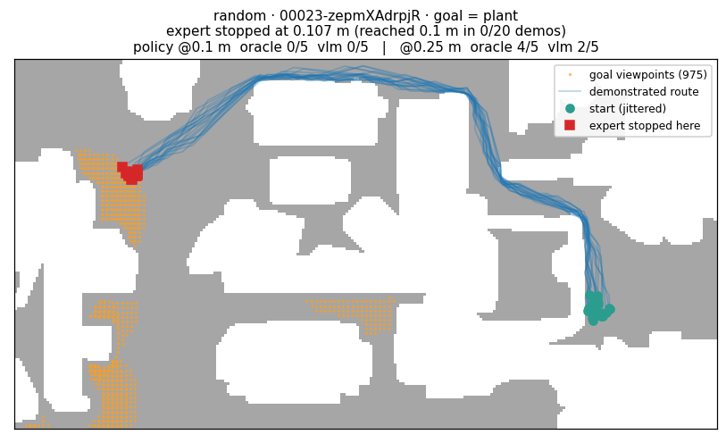

관찰 지점 975개 · 출발 거리 11.99 m · 걸은 거리 12.34 m (75 스텝) · **전문가 정지 거리 0.107 m** (범위 0.1~0.123) · 전문가 도달 0/20

정책 성공 — oracle 0/5 @0.1 m / 4/5 @0.25 m, VLM 0/5 @0.1 m / 2/5 @0.25 m

### random · 00025-ixTj1aTMup2 · 목표 = 텔레비전

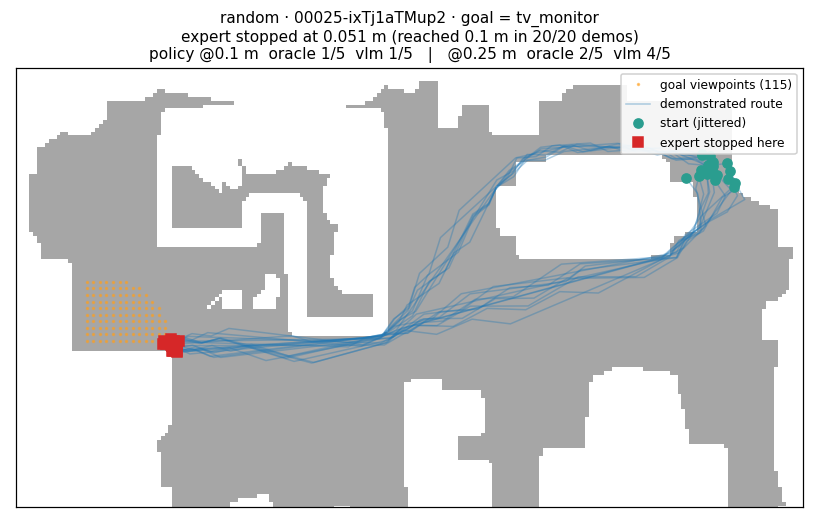

관찰 지점 115개 · 출발 거리 8.14 m · 걸은 거리 8.25 m (47 스텝) · **전문가 정지 거리 0.051 m** (범위 0.013~0.09) · 전문가 도달 20/20

정책 성공 — oracle 1/5 @0.1 m / 2/5 @0.25 m, VLM 1/5 @0.1 m / 4/5 @0.25 m

## matched — 경로 길이를 5.2~6.0 m로 통제

경로 8개, 전문가 도달률 79/160 = 0.494. 전문가가 한 번도 도달하지 못한 경로는 4개다.

### matched · 00006-HkseAnWCgqk · 목표 = 변기  ⚠ 전문가 도달 불가

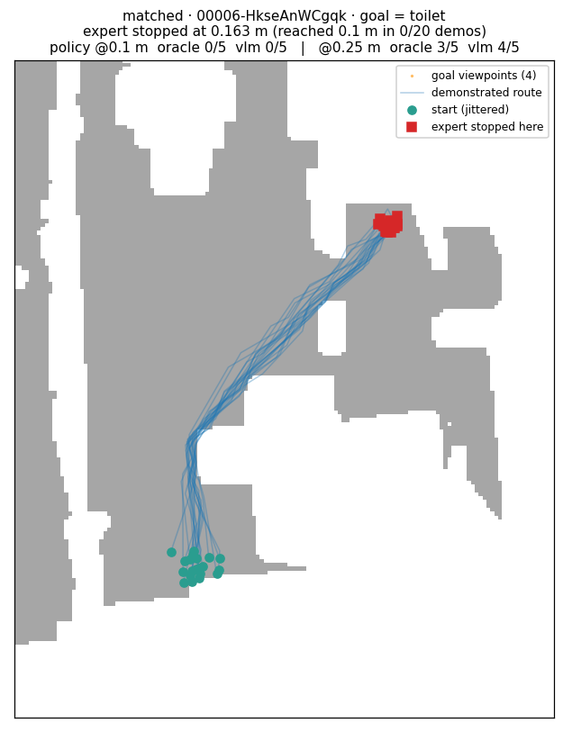

관찰 지점 4개 · 출발 거리 5.39 m · 걸은 거리 5.6 m (35 스텝) · **전문가 정지 거리 0.163 m** (범위 0.151~0.172) · 전문가 도달 0/20

정책 성공 — oracle 0/5 @0.1 m / 3/5 @0.25 m, VLM 0/5 @0.1 m / 4/5 @0.25 m

### matched · 00009-vLpv2VX547B · 목표 = 소파  ⚠ 전문가 도달 불가

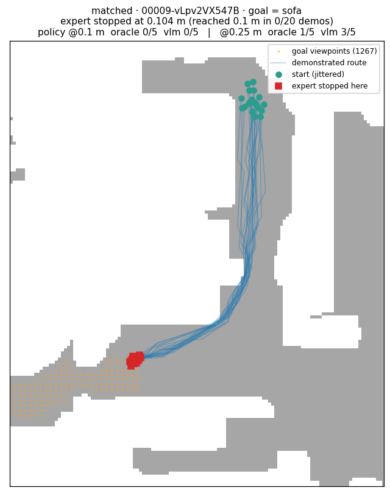

관찰 지점 1267개 · 출발 거리 5.29 m · 걸은 거리 5.6 m (33 스텝) · **전문가 정지 거리 0.104 m** (범위 0.101~0.126) · 전문가 도달 0/20

정책 성공 — oracle 0/5 @0.1 m / 1/5 @0.25 m, VLM 0/5 @0.1 m / 3/5 @0.25 m

### matched · 00016-qk9eeNeR4vw · 목표 = 변기

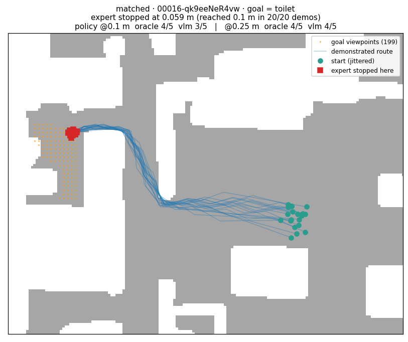

관찰 지점 199개 · 출발 거리 5.52 m · 걸은 거리 5.81 m (40 스텝) · **전문가 정지 거리 0.059 m** (범위 0.051~0.072) · 전문가 도달 20/20

정책 성공 — oracle 4/5 @0.1 m / 4/5 @0.25 m, VLM 3/5 @0.1 m / 4/5 @0.25 m

### matched · 00017-oEPjPNSPmzL · 목표 = 변기

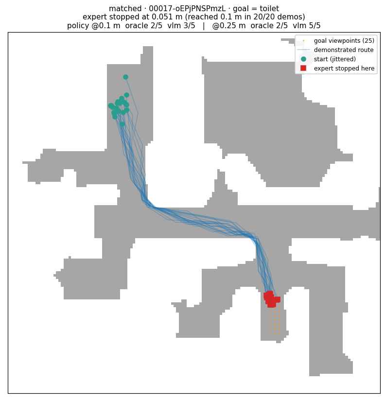

관찰 지점 25개 · 출발 거리 5.46 m · 걸은 거리 5.51 m (39 스텝) · **전문가 정지 거리 0.051 m** (범위 0.02~0.092) · 전문가 도달 20/20

정책 성공 — oracle 2/5 @0.1 m / 2/5 @0.25 m, VLM 3/5 @0.1 m / 5/5 @0.25 m

### matched · 00020-XYyR54sxe6b · 목표 = 텔레비전  ⚠ 전문가 도달 불가

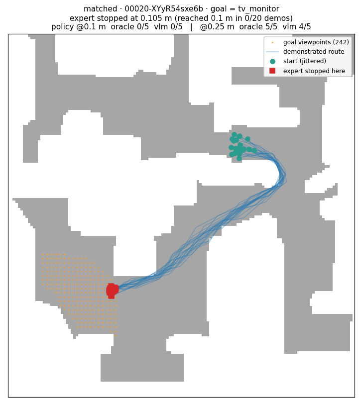

관찰 지점 242개 · 출발 거리 5.25 m · 걸은 거리 5.61 m (37 스텝) · **전문가 정지 거리 0.105 m** (범위 0.1~0.113) · 전문가 도달 0/20

정책 성공 — oracle 0/5 @0.1 m / 5/5 @0.25 m, VLM 0/5 @0.1 m / 4/5 @0.25 m

### matched · 00022-gmuS7Wgsbrx · 목표 = 의자

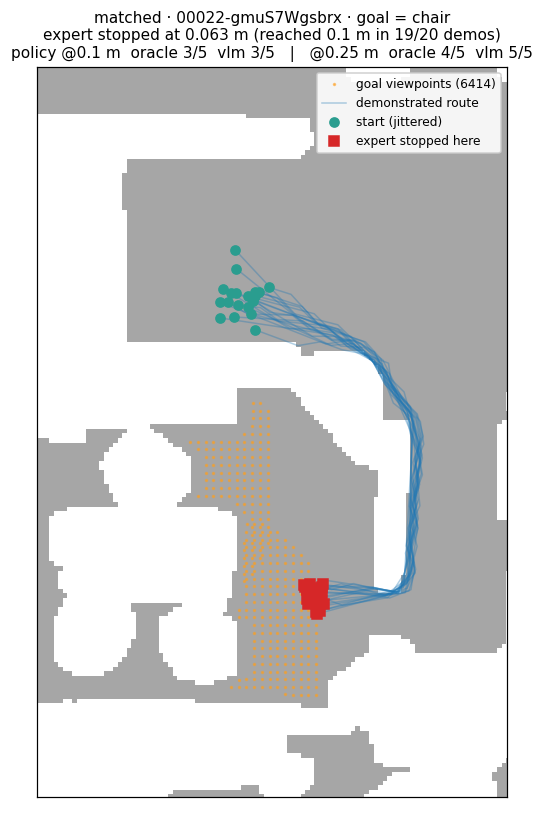

관찰 지점 6414개 · 출발 거리 5.19 m · 걸은 거리 5.33 m (37 스텝) · **전문가 정지 거리 0.063 m** (범위 0.056~0.103) · 전문가 도달 19/20

정책 성공 — oracle 3/5 @0.1 m / 4/5 @0.25 m, VLM 3/5 @0.1 m / 5/5 @0.25 m

### matched · 00023-zepmXAdrpjR · 목표 = 소파  ⚠ 전문가 도달 불가

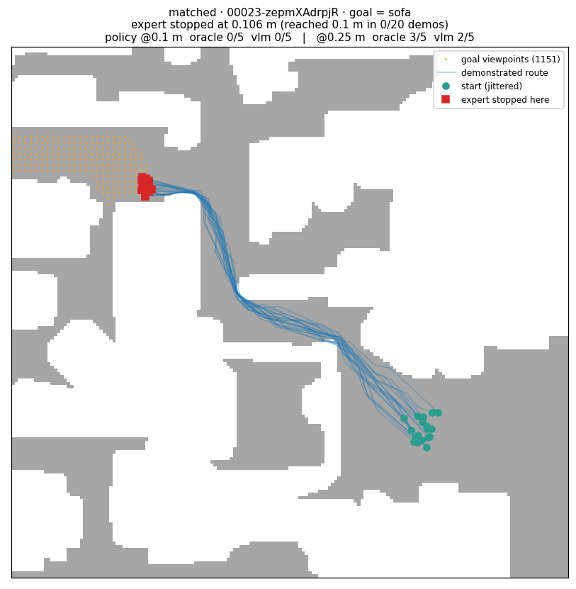

관찰 지점 1151개 · 출발 거리 6.11 m · 걸은 거리 6.36 m (40 스텝) · **전문가 정지 거리 0.106 m** (범위 0.102~0.132) · 전문가 도달 0/20

정책 성공 — oracle 0/5 @0.1 m / 3/5 @0.25 m, VLM 0/5 @0.1 m / 2/5 @0.25 m

### matched · 00025-ixTj1aTMup2 · 목표 = 화분

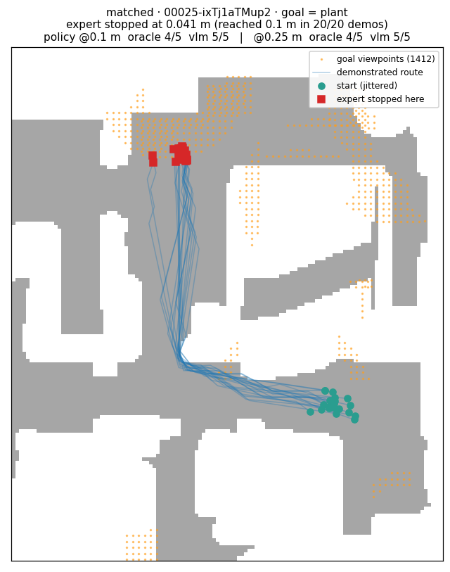

관찰 지점 1412개 · 출발 거리 5.17 m · 걸은 거리 5.31 m (33 스텝) · **전문가 정지 거리 0.041 m** (범위 0.022~0.08) · 전문가 도달 20/20

정책 성공 — oracle 4/5 @0.1 m / 4/5 @0.25 m, VLM 5/5 @0.1 m / 5/5 @0.25 m

## junction — 갈림길이 많은 경로

경로 8개, 전문가 도달률 117/160 = 0.731. 전문가가 한 번도 도달하지 못한 경로는 2개다.

### junction · 00006-HkseAnWCgqk · 목표 = 의자

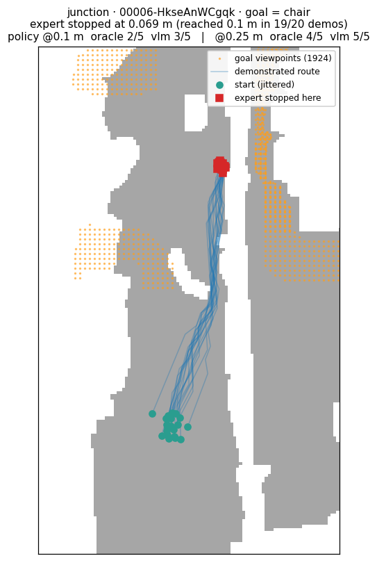

관찰 지점 1924개 · 출발 거리 4.64 m · 걸은 거리 5.0 m (29 스텝) · **전문가 정지 거리 0.069 m** (범위 0.046~0.103) · 전문가 도달 19/20

정책 성공 — oracle 2/5 @0.1 m / 4/5 @0.25 m, VLM 3/5 @0.1 m / 5/5 @0.25 m

### junction · 00009-vLpv2VX547B · 목표 = 텔레비전  ⚠ 전문가 도달 불가

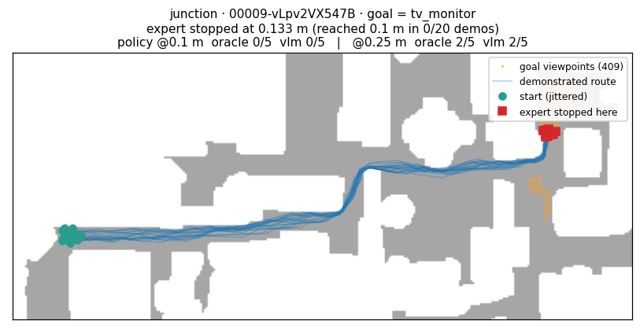

관찰 지점 409개 · 출발 거리 13.78 m · 걸은 거리 14.32 m (90 스텝) · **전문가 정지 거리 0.133 m** (범위 0.1~0.177) · 전문가 도달 0/20

정책 성공 — oracle 0/5 @0.1 m / 2/5 @0.25 m, VLM 0/5 @0.1 m / 2/5 @0.25 m

### junction · 00016-qk9eeNeR4vw · 목표 = 텔레비전

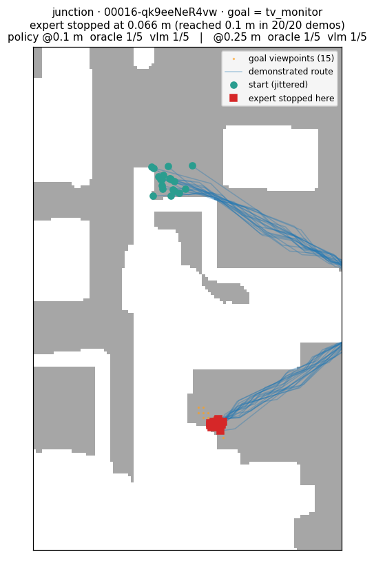

관찰 지점 15개 · 출발 거리 7.24 m · 걸은 거리 7.55 m (49 스텝) · **전문가 정지 거리 0.066 m** (범위 0.051~0.098) · 전문가 도달 20/20

정책 성공 — oracle 1/5 @0.1 m / 1/5 @0.25 m, VLM 1/5 @0.1 m / 1/5 @0.25 m

### junction · 00017-oEPjPNSPmzL · 목표 = 텔레비전

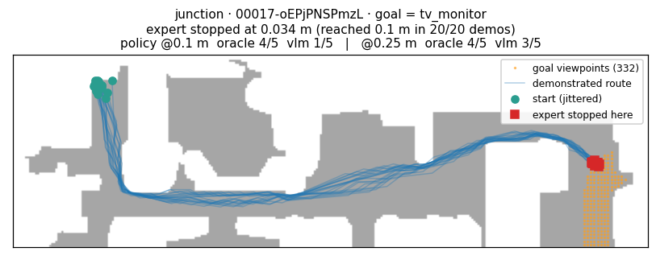

관찰 지점 332개 · 출발 거리 14.69 m · 걸은 거리 15.19 m (86 스텝) · **전문가 정지 거리 0.034 m** (범위 0.01~0.072) · 전문가 도달 20/20

정책 성공 — oracle 4/5 @0.1 m / 4/5 @0.25 m, VLM 1/5 @0.1 m / 3/5 @0.25 m

### junction · 00020-XYyR54sxe6b · 목표 = 화분

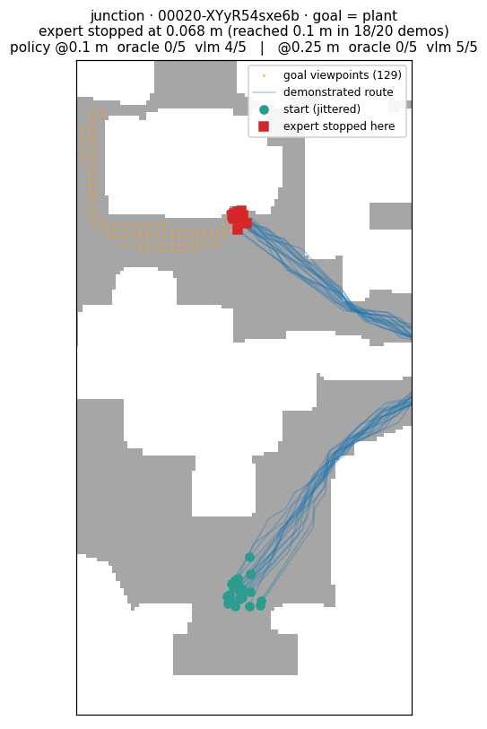

관찰 지점 129개 · 출발 거리 7.49 m · 걸은 거리 7.88 m (49 스텝) · **전문가 정지 거리 0.068 m** (범위 0.05~0.108) · 전문가 도달 18/20

정책 성공 — oracle 0/5 @0.1 m / 0/5 @0.25 m, VLM 4/5 @0.1 m / 5/5 @0.25 m

### junction · 00022-gmuS7Wgsbrx · 목표 = 침대

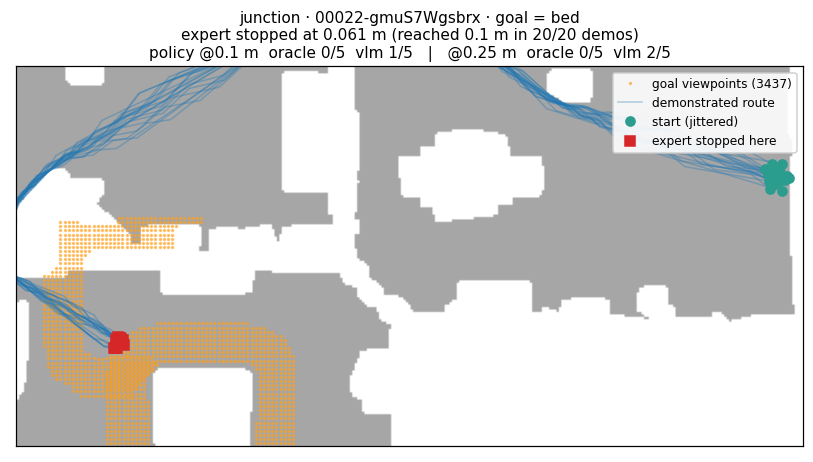

관찰 지점 3437개 · 출발 거리 26.79 m · 걸은 거리 27.57 m (154 스텝) · **전문가 정지 거리 0.061 m** (범위 0.05~0.089) · 전문가 도달 20/20

정책 성공 — oracle 0/5 @0.1 m / 0/5 @0.25 m, VLM 1/5 @0.1 m / 2/5 @0.25 m

### junction · 00023-zepmXAdrpjR · 목표 = 텔레비전  ⚠ 전문가 도달 불가

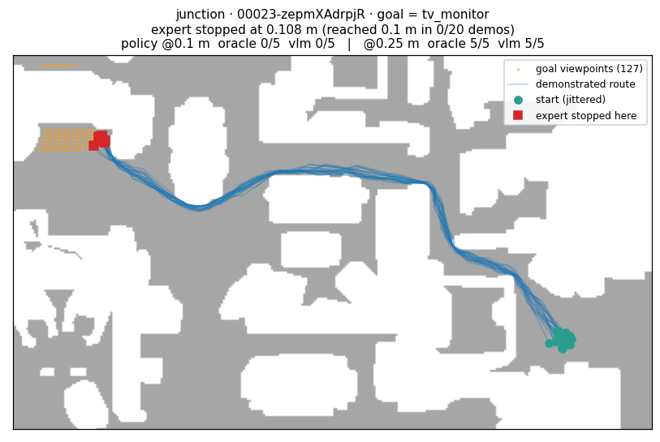

관찰 지점 127개 · 출발 거리 14.39 m · 걸은 거리 14.88 m (88 스텝) · **전문가 정지 거리 0.108 m** (범위 0.102~0.136) · 전문가 도달 0/20

정책 성공 — oracle 0/5 @0.1 m / 5/5 @0.25 m, VLM 0/5 @0.1 m / 5/5 @0.25 m

### junction · 00025-ixTj1aTMup2 · 목표 = 침대

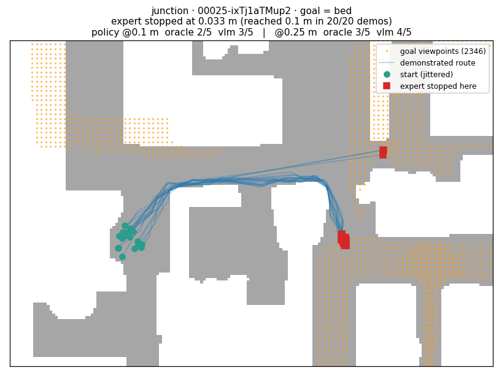

관찰 지점 2346개 · 출발 거리 5.15 m · 걸은 거리 5.26 m (37 스텝) · **전문가 정지 거리 0.033 m** (범위 0.016~0.085) · 전문가 도달 20/20

정책 성공 — oracle 2/5 @0.1 m / 3/5 @0.25 m, VLM 3/5 @0.1 m / 4/5 @0.25 m


---

## 지도가 보여 주는 것

**전문가 정지 거리 하나가 경로의 운명을 결정한다.** 24개 경로를 전문가 도달률로 갈라
비교하면 다음과 같다.

| | 경로 수 | 전문가 정지 거리 중앙값 | 관찰 지점 중앙값 | 걸은 거리 중앙값 |
|---|---|---|---|---|
| 도달률 0/20 | 9 | **0.108 m** | 409개 | 6.4 m |
| 도달률 17/20 이상 | 15 | **0.059 m** | 332개 | 5.3 m |

두 무리를 가르는 것은 정지 거리뿐이다. 실패하는 무리가 **관찰 지점은 오히려 더 많고**
(409개 대 332개) 걸은 거리도 비슷하다.
정지 거리만 0.1 m 선을 사이에 두고 갈라진다.

그림에서도 같은 것이 보인다. 실패하는 경로에서도 파란 선은 주황 점 무리까지 정확히
이어지고 빨간 사각형은 그 바로 옆에 찍힌다. 길을 잘못 든 그림은 하나도 없다. 다만 빨간
사각형이 주황 점과 겹치지 못하고 몇 픽셀 옆에 놓일 뿐이다. 지도의 축척이 픽셀당 0.05 m
이므로, 성패를 가르는 거리는 그림에서 두세 픽셀에 해당한다.


**0.25 m 기준을 함께 보면 무엇이 달라지는가.** 전진 한 걸음에 해당하는 0.25 m로 기준을 바꾸면
VLM 정책의 성공 횟수가 늘어나는 경로가 21개다. 그중 변화가 큰 것들은 다음과 같다.

| 경로 | 목표 | 전문가 정지 거리 | VLM @0.1 m | VLM @0.25 m |
|---|---|---|---|---|
| random · 00020 | 변기 | 0.11 m | 0/5 | **5/5** |
| junction · 00023 | 텔레비전 | 0.108 m | 0/5 | **5/5** |
| matched · 00006 | 변기 | 0.163 m | 0/5 | **4/5** |
| matched · 00020 | 텔레비전 | 0.105 m | 0/5 | **4/5** |
| random · 00009 | 텔레비전 | 0.126 m | 0/5 | **3/5** |
| random · 00025 | 텔레비전 | 0.051 m | 1/5 | **4/5** |
| matched · 00009 | 소파 | 0.104 m | 0/5 | **3/5** |
| random · 00017 | 변기 | 0.047 m | 2/5 | **4/5** |

0.1 m는 시뮬레이터와 선행 연구가 쓰는 표준이므로 비교를 위해 유지해야 하지만, 그 숫자 하나만
보면 길찾기 능력과 정지 정밀도가 뭉쳐서 보인다. 두 기준을 나란히 적으면 어느 쪽이 부족한지
구분된다.

## 이 문서를 다시 만들려면

```
python -m vlm_topology_test.phase3_fixed_route.visualize_routes
```

시뮬레이터가 필요하므로 `slurm/p3_route_maps.slurm`으로 제출한다. 위치는 저장된 시연에서
읽고 시뮬레이터는 평면도와 관찰 지점을 얻는 데에만 쓰므로, 그려진 경로는 정책이 실제로
학습한 그 경로다. 산출물은 `results/route_maps/*.png`와 `results/route_index.json`이다.

